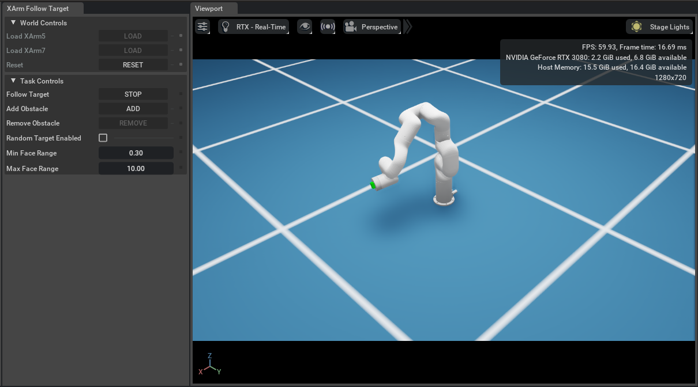
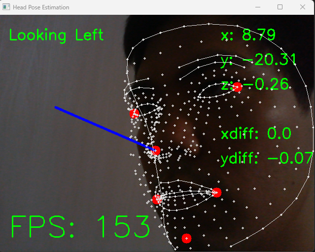

<a name="readme-top"></a>

<!-- PROJECT SHIELDS -->
<!--
*** I'm using markdown "reference style" links for readability.
*** Reference links are enclosed in brackets [ ] instead of parentheses ( ).
*** See the bottom of this document for the declaration of the reference variables
*** for contributors-url, forks-url, etc. This is an optional, concise syntax you may use.
*** https://www.markdownguide.org/basic-syntax/#reference-style-links
-->
[![Contributors][contributors-shield]][contributors-url]
[![Forks][forks-shield]][forks-url]
[![Stargazers][stars-shield]][stars-url]
[![Issues][issues-shield]][issues-url]
[![LinkedIn][linkedin-shield]][linkedin-url]


<!-- PROJECT LOGO -->
<br />
<div align="center">
  <a href="https://github/MatthewDZane/XArmFollowTarget/images/IsaacSim.png">
    
  </a>

  <h3 align="center">XArm Follow Target</h3>

  <p align="center">
    An Autonomous Camera Controller Robot
    <br />
    <a href="https://github/MatthewDZane/XArmFollowTarget"><strong>Explore the docs »</strong></a>
    <br />
    </a>
  </p>
</div>

<!-- TABLE OF CONTENTS -->
<details>
  <summary>Table of Contents</summary>
  <ol>
    <li>
      <a href="#about-the-project">About The Project</a>
      <ul>
        <li><a href="#built-with">Built With</a></li>
      </ul>
    </li>
    <li>
      <a href="#using-xarm-follow-target-as-a-third-party-extension">Using Xarm Follow Target as a Third Party Extension</a>
    </li>
  </ol>
</details>


<!-- ABOUT THE PROJECT -->
## About The Project

This project autonomously controls a RealSense Camera mounted to an [XArm Robot](https://www.ufactory.cc/xarm-collaborative-robot). The repo is comprised of several scripts, which are designed to run synchronously across several different machines (XArm Robot, Local RealSense Camera Machine, and Remote Nautilus Cluster Machine), which utilize NVidia's [Isaac Sim](https://developer.nvidia.com/isaac-sim) and Intel's [RealSense Camera](https://www.intelrealsense.com/). 

First the RealSense Camera script sends positional data to the remote machine, using OpenCV and the Camera's depth sensors. Then, the custom Isaac Sim Extension runs a Follow Target task, solving the Kinematic equations, to calculate the correct orientation of the XArm. Finally, these new orientations are sent back to the XArm itself to then update the robot is real life.

This project was headed by Professor Robert Twomey at the University of Nebraska Lincoln and is intented for educational and experimental use.

<p align="right">(<a href="#readme-top">back to top</a>)</p>


### Built With

This project was built using the following. 

* [XArm](https://www.ufactory.cc/xarm-collaborative-robot)
* [Isaac Sim](https://developer.nvidia.com/isaac-sim)
* [RealSense Camera](https://www.intelrealsense.com/)

<div align="center">
  <a href="https://gitlab.nrp-nautilus.io/MatthewZane/XArmFollowTarget/images/RealSenseCamera.png">
    
  </a>
</div>

# Using XArm Follow Target as a Third Party Extension
1. Clone the repo into the directory where you would like to store Isaac Sim Extensions
2. Open Isaac Sim and go to Windows->Extensions
3. Click the Settings Icon (Gear) and add the path to the parent directory of the repo (not XArm or XArmFollowTarget). Now the XArm Follow Target Extention should show up under the Third Party Extensions.
4. Enable the XArm Follow Target Extension and check the Autoload setting. The XArm Follow Target Extension will now appear on the top menu bar of the Isaac Sim Application.
5. Click the XArm Follow Target to use the Extension

Port Forward local ports to the Container for the realsense camera client. 
- once you have a XGL container running you will need to use the kubernetes CLI to get the specific pod name. This can be done with 

```
 kubectl get pods -n <your namespace>
```
once you have your pod name we can now prot forward the local ports to the container for communication, 

Run 
```
 kubectl port-forward <running XGL pod> 12345:12345 12346:12346 -n <your namespace>

```
We use these ports by default 

<!-- MARKDOWN LINKS & IMAGES -->
<!-- https://www.markdownguide.org/basic-syntax/#reference-style-links -->
[contributors-shield]: https://img.shields.io/github/contributors/MatthewDZane/XArmFollowTarget.svg?style=for-the-badge
[contributors-url]: https://gitlab.nrp-nautilus.io/MatthewZane/XArmFollowTarget/graphs/contributors
[forks-shield]: https://img.shields.io/github/forks/MatthewDZane/XArmFollowTarget.svg?style=for-the-badge
[forks-url]: https://gitlab.nrp-nautilus.io/MatthewZane/XArmFollowTarget/network/members
[stars-shield]: https://img.shields.io/github/stars/MatthewDZane/XArmFollowTarget.svg?style=for-the-badge
[stars-url]: https://gitlab.nrp-nautilus.io/MatthewZane/XArmFollowTarget/stargazers
[issues-shield]: https://img.shields.io/github/issues/MatthewDZane/XArmFollowTarget.svg?style=for-the-badge
[issues-url]: https://gitlab.nrp-nautilus.io/MatthewZane/XArmFollowTarget/issues
[linkedin-shield]: https://img.shields.io/badge/-LinkedIn-black.svg?style=for-the-badge&logo=linkedin&colorB=555
[linkedin-url]: https://linkedin.com/in/matthewdzane
